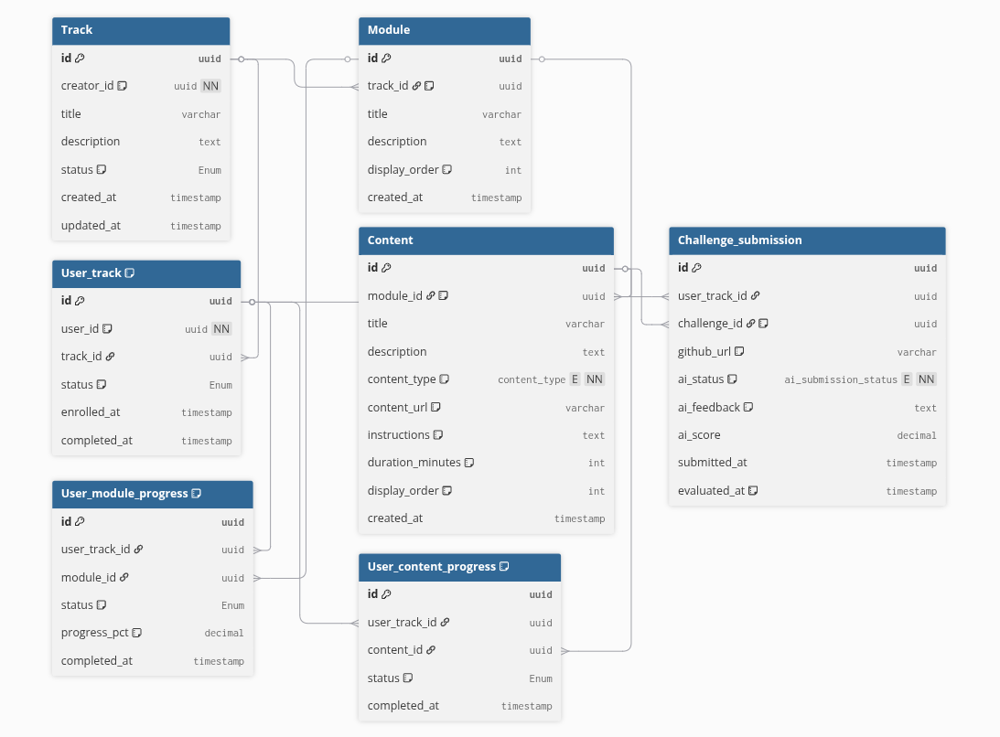

# Tracks Service 🛤️

Microserviço do ecossistema **Atlas** responsável pelo gerenciamento de trilhas de aprendizado. Fornece modelos, endpoints e lógica de domínio para criação, atualização e consulta de trilhas, módulos, conteúdos e matrículas de alunos.

## Stack

- Python 3.11 · Django · Django REST Framework
- PostgreSQL · Redis · RabbitMQ + Celery
- Docker

## Estrutura

- `apps/tracks/` — models, views, serializers, services, tasks
- `config/settings/` — settings modularizados por ambiente

> 

## Executando localmente

Este serviço é orquestrado junto com todos os outros pelo repositório central de infraestrutura:

> **[Atlas-IFRN/atlas-infra](https://github.com/Atlas-IFRN/atlas-infra)** — Docker Compose canônico, Nginx, scripts de deploy e backup.

Para subir apenas a infraestrutura compartilhada (Postgres, Redis, RabbitMQ) e rodar este serviço isolado em modo dev:

```bash
# 1. Suba a infra compartilhada
git clone https://github.com/Atlas-IFRN/atlas-infra
cd atlas-infra
docker compose -f docker-compose.dev.yml up -d

# 2. Neste repositório
cp .env.example .env
python manage.py migrate
python manage.py runserver 8001

# 3. (Opcional) Worker Celery
celery -A config worker -l info -Q tracks
```

## Variáveis de ambiente

Veja `.env.example`. Principais: `DATABASE_URL`, `REDIS_URL`, `RABBITMQ_URL`, `AUTH_SERVICE_URL`, `INTERNAL_TOKEN`.

## Endpoints

Documentação interativa disponível em:
- **Swagger UI:** `http://localhost:8000/api/track/docs/`
- **JSON Schema:** `http://localhost:8000/api/track/schema/`

### Trilhas (`/api/track/tracks/`)

| Método | Endpoint | Descrição |
|--------|----------|-----------|
| `GET`  | `/api/track/tracks/` | Lista trilhas com `modules_count` agregado |
| `POST` | `/api/track/tracks/` | Cria trilha (TEACHER) |
| `GET`  | `/api/track/tracks/{id}/` | Detalhe com árvore completa de módulos e conteúdos |
| `PUT/PATCH` | `/api/track/tracks/{id}/` | Atualiza trilha (TEACHER) |
| `DELETE` | `/api/track/tracks/{id}/` | Remove trilha (TEACHER) |

### Módulos (`/api/track/modules/`)

| Método | Endpoint | Descrição |
|--------|----------|-----------|
| `GET`  | `/api/track/modules/?track_id=UUID` | Módulos de uma trilha com `contents_count` |
| `GET`  | `/api/track/modules/{id}/` | Módulo com conteúdos aninhados |

### Conteúdos (`/api/track/contents/`)

| Método | Endpoint | Descrição |
|--------|----------|-----------|
| `GET`  | `/api/track/contents/?module_id=UUID` | Conteúdos de um módulo |
| `GET`  | `/api/track/contents/{id}/` | Conteúdo individual |

### Matrículas (`/api/track/user-tracks/`)

| Método | Endpoint | Descrição |
|--------|----------|-----------|
| `GET`  | `/api/track/user-tracks/` | Lista matrículas |
| `POST` | `/api/track/user-tracks/` | Matricula aluno em trilha publicada |

## Regras de negócio

- Apenas trilhas com `status=PUBLISHED` aceitam matrículas
- Aluno pode ter no máximo **3 trilhas em andamento** simultaneamente
- Professor não pode se matricular em trilhas
- Trilha não pode ser publicada sem ao menos um módulo
- Exclusão bloqueada se houver matrículas `IN_PROGRESS`

## Permissões

`IsTeacherOrReadOnly` — lê a role diretamente do header `X-User-Role` injetado pelo Nginx.

## Testes

```bash
python manage.py test
python manage.py test apps.tracks   # só a app de trilhas
```

## Qualidade de código

```bash
pip install pre-commit && pre-commit install
pre-commit run --all-files
```

